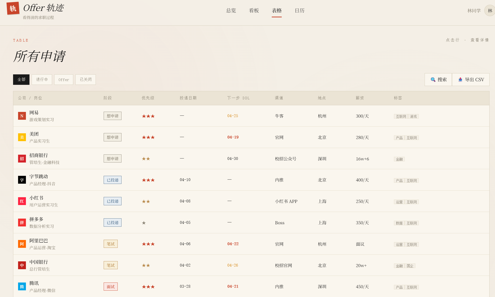

# Offer Trail

Offer Trail 是一个面向大学生和应届生的求职流程管理应用，帮助你把分散在不同平台的投递记录整理成可追踪、可复盘、可导出的个人求职看板。

它不是招聘平台，而是你的求职作战面板：
- 看清每个岗位当前阶段（想申请/已投递/笔试/面试/Offer/已关闭）
- 管理关键时间点（DDL、笔试、面试）
- 沉淀面试复盘，减少重复踩坑

## 核心功能

- 多视图管理：总览、看板、表格、日历
- 阶段跟踪：覆盖完整投递流程状态
- 紧急提醒：按截止日期和优先级筛选任务
- 快速录入：支持快速添加公司、岗位、链接和 DDL
- 数据持久化：本地 localStorage 自动保存
- 数据迁移：支持 JSON 导入/导出，支持 CSV 导出
- 复盘沉淀：面试后记录情绪、问题与改进建议

## 技术栈

- React 18
- Vite 5
- React Router
- Tailwind CSS
- Radix UI
- TanStack Query

## 在线演示地址

- Live Demo（主地址）：https://go2ile.nocode.host
- Mirror（备用地址）：https://go2ile.nocode.host

> 建议将上述链接替换为你部署后的真实地址（如 Vercel / Netlify）。

## 项目截图区

> 建议至少放 4 张图：首页、看板、表格、日历，能快速体现完整能力。

截图目录：`public/screenshots/`

### 1) 首页（产品定位）


### 2) 看板视图（阶段管理）


### 3) 表格视图（信息总览）



### 4) 日历视图（时间管理）


### 截图建议

- 分辨率建议：1200 x 675（16:9）
- 命名建议：01-home.png / 02-dashboard.png / 03-table.png / 04-calendar.png
- 内容建议：保留一组有代表性的示例数据，突出流程进展与复盘能力

## 快速开始

### 1. 安装 Node.js（推荐 18+）

如果你使用 nvm：

```bash
nvm install 18
nvm use 18
```

### 2. 安装依赖

```bash
npm install
```

### 3. 启动开发环境

```bash
npm run dev
```

默认启动后访问本地 Vite 地址即可。

## 可用脚本

```bash
npm run dev        # 本地开发
npm run build      # 生产构建
npm run build:dev  # 开发模式构建
npm run preview    # 预览构建结果
npm run lint       # 代码检查
```

## 路由说明

- /：项目介绍页
- /offer-trail：Offer Trail 主应用页面

## 项目结构

```text
src/
	components/ui/   # 通用 UI 组件
	pages/           # 页面（Index / OfferTrail）
	App.jsx          # 路由入口
	main.jsx         # 应用启动入口
```

## 数据说明

- 应用默认使用示例数据初始化
- 数据存储在浏览器 localStorage
- 存储键：offer-trail-data-v1

## 适用场景

- 同时投递多个岗位，需要统一管理进度
- 希望把面试经验结构化沉淀
- 想要一眼看清本周 DDL 与面试安排

## License

仅用于学习与作品展示。
